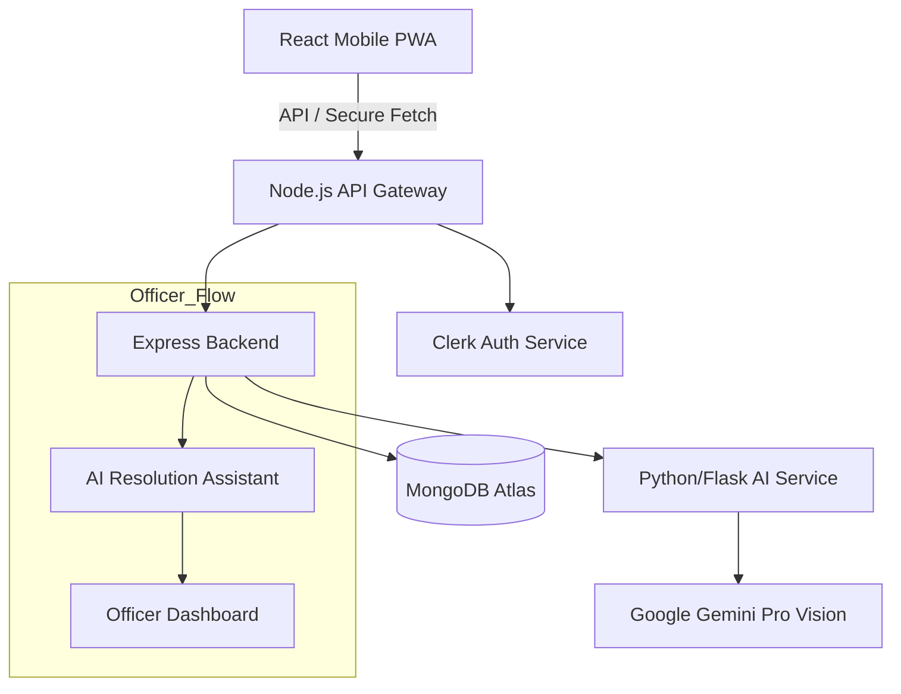

# 🚀 Project Submission: Civix
**Theme:** Open Innovation
**Team:** [Your Team Name]
**Leader:** [Your Name]

---

## 1. Problem Statement: "The Broken Feedback Loop"
**The Core Issue:**
Modern cities suffer from a "Civic Disconnect." Citizens encounter infrastructure failures daily (potholes, garbage, broken lights) but feel powerless to fix them.
*   **Apathy:** "Why report if nothing changes?"
*   **Opacity:** No visibility into government action.
*   **Inefficiency:** Authorities are flooded with unverified, unstructured/spam complaints.

**The Gap:** Existing reporting tools are static "dropboxes" for complaints—boring, unidirectional, and often ignored.

---

## 2. Our Solution: Civix
**"Gamifying Civic Responsibility with AI"**

Civix is not just a reporting tool; it is a **Civic Engagement Ecosystem**. 
We bridge the gap between citizens and authorities by transforming issue reporting into a rewarding, transparent, and collaborative experience.

*   **For Citizens:** A gamified platform where reporting earns **XP**, badges, and community status.
*   **For Authorities:** An **AI-powered Command Center** that auto-verifies, prioritizes, and assigns issues to ground officers in real-time.

---

## 3. Opportunities & Differentiation

### a. How is it different? (The "X" Factor)
| Feature | Traditional Apps | **Civix (Our Solution)** |
| :--- | :--- | :--- |
| **Verification** | Manual & Slow | **AI-Powered (Smart Verification)** instant verification |
| **Incentive** | None (Altruism only) | **Gamified (XP/Leaderboards)** rewarding participation |
| **Workflow** | Black Box (Report & Pray) | **Transparent Lifecycle** (Report -> Officer -> Verify -> User Notification) |
| **Engagement** | User vs. Gov (Adversarial) | **Community Collaboration** (Voting, Discussion, Trust) |

### b. How does it solve the problem?
1.  **Eliminates Spam:** AI filters out fake/irrelevant reports before they reach officers.
2.  **Motivates Action:** Gamification turns passive residents into active "Civic Guardians."
3.  **Community Prioritization:** Issues are ranked by "Upvotes" and "AI Severity," ensuring that the most urgent community needs are solved first, regardless of location.

---

## 4. Key Roles & Workflow
We have designed a multi-tiered ecosystem to ensure Checks & Balances:
1.  **🧑‍🤝‍🧑 Citizen:** Reports issues, Upvotes (Prioritizes) community needs, and earns XP.
2.  **🛡️ Moderator:** Top-tier users who validate "Flagged" posts to prevent spam/abuse (Community Policing).
3.  **👮 Officer:** The ground force. Receives AI-prioritized tasks and uses the **AI Resolution Assistant**.
4.  **👨‍💻 Admin:** System oversight, analytics, and department resource allocation.

---

## 5. Key Features
*   **AI Engine:** Python (Flask) Service interfacing with **Google Gemini API**
*   **Auth:** Clerk (Secure Identity Management)
*   **Media:** Cloudinary (Image Optimization & Secure Storage)
*   **📸 Snap & Solve:** One-tap issue reporting with auto-geolocation.
*   **🧠 AI Sentinel (Intelligent Vision):** Automatically analyzes uploaded photos to classify severity.
*   **🤖 AI Resolution Assistant (For Officers):**
    *   *Smart Routing:* Suggests the best route to multiple issues.
    *   *Auto-Drafting:* AI drafts the "Issue Resolved" message to the citizen based on the fix photo.
    *   *Similar Case Search:* Shows officers how similar potholes/issues were fixed in the past.
*   **🏆 Gamification:** XP, Leaderboards, and Badges.
*   **🗳️ Community Voting:** Reddit-style prioritization.
*   **💬 Community Hub:** A dedicated space for citizens to discuss issues, share local news, and organize events.

---

## 5. Google Technologies Used
This solution is **Powered by Google**:
1.  **Google Gemini Pro Vision:** The brain of our operation. We use it to analyze user-uploaded images to detect potholes/garbage, reject unrelated images, and assess urgency.
2.  **Google Maps Platform:** Provides the interactive base for our "Civic Map" and powers the geocoding for precise location tracking.
3.  **Google Cloud / Firebase:** (If applicable) Scalable backend handling for real-time notifications.

---

## 6. Process Flow (Use Case)

**[Citizen]** _(Uploads Photo)_ --> **[AI Sentinel]** _(Verifies & Tags)_ --> **[Moderator]** _(Validates Flagged)_ --> **[System]** _(Assigns to Dept)_
                                                                                                    |
                                                                                                    v
**[Citizen]** _(Receives Update)_ <-- **[System]** <-- **[Officer]** _(Fixes & Uploads Proof)_ <-- **[AI Assistant]** _(Suggests Fix/Route)_

---

## 7. Architecture & Diagrams

### 🏗️ Architecture Diagram

### 👤 Use Case Diagram
*   **Citizen:** Login, Report Issue, Upvote, View Leaderboard.
*   **Moderator:** Review Flagged Reports, Approve Community Posts.
*   **Officer:** View Assigned Tasks, Get AI Route, Mark Resolved (w/ Photo).
*   **Admin:** User Management, Analytics Dashboard, Dept Management.

### 📱 Wireframes / Mockups
*We have developed high-fidelity mockups (visible in MVP/Video)*:
1.  **Reporting Screen:** Camera view with "AI Analyzing..." overlay.
2.  **Civic Map:** Dark mode map with pulsing beacons for issues.
3.  **Officer View:** Split screen—Map on top, "AI Assistant" chat/suggestions below.

---

## 8. MVP Snapshots
*(Insert Screenshots Here)*
*   **Slide 1:** The "Gamified" User Dashboard showing Level & XP.
*   **Slide 2:** The "AI Analysis" in action (detecting a pothole).
*   **Slide 3:** The "Officer Map" showing clustered issues.

---

## 9. Future Roadmap
*   **IoT Integration:** Auto-creation of tickets from smart streetlights/sensors.
*   **Blockchain Audit:** Storing complaint resolution logs on-chain for immutable transparency.
*   **Predictive Maintenance:** Using historical data to predict *where* the next pothole will form.

---

## 10. Links
*   **GitHub:** [Link to your repo]
*   **Demo Video:** [Link to your video]
*   **Live MVP:** https://civix-plus.vercel.app/
