# 🎨 Visual Architecture & Design (Mermaid.js)
*Copy these into [Mermaid Live Editor](https://mermaid.live/) for professional, colored diagrams.*

## 1. 🏗️ The Civix Ecosystem (Holistic Architecture)
A modern, microservices-ready architecture powering the ecosystem.

```mermaid
graph TD
    %% Styling Definitions
    classDef client fill:#e1f5fe,stroke:#01579b,stroke-width:2px,color:#01579b;
    classDef cloud fill:#f3e5f5,stroke:#7b1fa2,stroke-width:2px,color:#4a148c;
    classDef backend fill:#e8f5e9,stroke:#2e7d32,stroke-width:2px,color:#1b5e20;
    classDef ai fill:#fff3e0,stroke:#e65100,stroke-width:2px,color:#bf360c;
    classDef db fill:#eceff1,stroke:#455a64,stroke-width:2px,stroke-dasharray: 5 5;

    subgraph Client_Zone ["📱 User Interfaces"]
        Citizens["🧑‍🤝‍🧑 Citizen PWA"]:::client
        Officers["👮 Officer App"]:::client
        AdminDB["👨‍💻 Admin Insights & Mods"]:::client
    end

    subgraph Integration_Zone ["🛡️ Secure Gateway"]
        Auth["🔐 Clerk Auth"]:::cloud
        API["🌐 Express Gateway"]:::backend
    end

    subgraph Core_Services ["⚙️ Backend Engine"]
        Logic["🧠 Business Logic"]:::backend
        Community["💬 Community Hub"]:::backend
        Gamification["🏆 XP System"]:::backend
    end

    subgraph Neural_Zone ["🧠 AI & Intelligence"]
        Vision["👁️ Google Gemini Vision"]:::ai
        Predict["🔮 Predictive Analytics"]:::ai
        Route["📍 Smart Routing"]:::ai
    end

    subgraph Infra_Zone ["☁️ Infrastructure"]
        DB[("🗄️ MongoDB Atlas")]:::db
        Media[("🖼️ Cloudinary Media")]:::db
        Maps[("🗺️ Google Maps")]:::db
    end

    %% Connections
    Citizens & Officers & AdminDB -->|"Secure TLS"| Auth
    Auth --> API
    API --> Logic
    
    Logic <--> Community & Gamification
    Logic --> DB
    
    %% AI Integrations
    Logic --> Vision
    Logic --> Predict
    Officers --> Route
    
    %% External Services
    Logic --> Media
    Citizens --> Maps
    Officers --> Maps
```

---

## 2. 🌀 The Vicious Loop Breaker (Use Case)
How Civix transforms apathy into action through distinct roles.

```mermaid
graph LR
    %% Styles
    classDef role fill:#fff9c4,stroke:#fbc02d,stroke-width:2px;
    classDef action fill:#e3f2fd,stroke:#2196f3,stroke-width:1px,rx:5,ry:5;
    classDef value fill:#fff,stroke:#4caf50,stroke-width:4px,color:#2e7d32;

    Citizen(("👤 Citizen")):::role
    Moderator(("🛡️ Moderator")):::role
    Officer(("👮 Officer")):::role
    Admin(("👨‍💻 Admin")):::role

    subgraph Community_Hub ["💬 The Community Hub"]
        Posts["📢 Create Posts"]:::action
        Polls["� Local Polls"]:::action
        Events["� Join Events"]:::action
    end

    subgraph Core_Flow ["⚡ Resolution Loop"]
        Report["� Snap & Solve"]:::action
        Triage["🧠 AI Auto-Triage"]:::value
        Resolve["🛠️ Fix & Verify"]:::action
        XP["🏆 Earn Rewards"]:::value
    end
    
    subgraph Insight_Engine ["📈 Admin Command"]
        Heatmap["🗺️ Risk Heatmaps"]:::action
        Allocation["🚚 Resource Alloc"]:::action
        Audit["� Gov Audit Logs"]:::action
    end

    %% Flow
    Citizen --> Report & Posts & Polls
    Report --> Triage
    Triage --> Officer
    
    Officer --> Resolve
    Resolve --> XP
    XP --> Citizen
    
    %% Admin Oversight
    Report -.-> Heatmap
    Officer -.-> Allocation
    Admin --> Heatmap & Allocation & Audit
    
    %% Mod Loop
    Posts -.-> Moderator
    Moderator -->|"Approve/Ban"| Posts
```

---

## 3. 🤝 The "Proof-of-Fix" Workflow (Sequence)
The transparent handshake between Citizen, AI, and Government.

```mermaid
sequenceDiagram
    autonumber
    actor C as 🧑‍🤝‍🧑 Citizen
    participant AI as 🧠 Civix AI
    actor O as � Officer
    actor A as 👨‍� Admin

    Note over C, AI: 1. The Reporting Phase
    C->>AI: 📸 Uploads Photo of Pothole
    AI->>AI: 👁️ Vision: "Severity High, Loc: Main St"
    AI-->>C: ✅ Ticket #9021 Created (+10 XP)

    Note over AI, A: 2. Intelligence Phase
    AI->>A: 📊 Updates Heatmap (New Hotspot)
    AI->>O: 🚨 PUSH: "Urgent Repair Nearby"
    
    Note over O: 3. Resolution Phase
    O->>O: �️ Arrives & Repairs
    O->>AI: � Uploads "Proof of Fix" Photo
    AI->>AI: � Verify Fix vs Original
    
    Note over AI, C: 4. The Loop Closes
    AI->>C: 🎊 Notification: "Your Report is Fixed!"
    C->>AI: ⭐ Rates Quality (5 Stars)
    AI-->>O: �️ Trust Score Increased
    AI-->>C: � Badge Unlocked: "Road Guardian"
```

